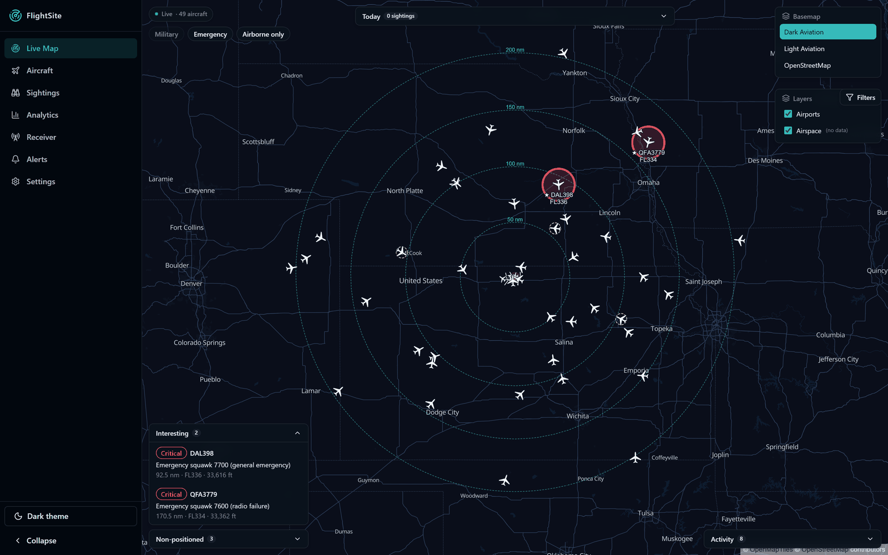

# FlightSite

**Self-hosted ADS-B observatory.** Point it at the decoder you already run, and get a
live map, a permanent history, analytics about your own receiver, and a notification
when something interesting flies over.

FlightSite answers the question:

> What is my receiver seeing, what has it seen historically, how unusual is what I am
> seeing now, and is anything particularly interesting happening?



*The Live Map, running in demo mode.*

---

## Quick start

You need a 64-bit Linux host (a Raspberry Pi 4 is the design target), Docker with the
Compose plugin, and a decoder — readsb, dump1090-fa, or tar1090 — already serving
`aircraft.json` over HTTP.

```bash
# 1. Create the data directory. The backend runs as uid 1000.
sudo mkdir -p /opt/flightsite/data
sudo chown 1000:1000 /opt/flightsite/data

# 2. Fetch the compose file.
cd /opt/flightsite
sudo curl -fsSLO https://raw.githubusercontent.com/stevenpickles/flightsite/main/compose.yaml

# 3. Start.
docker compose pull
docker compose up -d
```

Open **`http://<host-ip>:8090/`** and complete the setup wizard.

> **Then restart the backend once — aircraft will not appear until you do.**
>
> ```bash
> docker compose restart flightsite-backend
> ```
>
> Ingestion starts at boot when a saved configuration exists, and on a fresh install
> there is none at that moment. This applies only to the first save.

Just want to look around? No decoder, no configuration, no hardware:

```bash
FLIGHTSITE_DEMO=1 docker compose up -d
```

**Read [docs/INSTALL.md](docs/INSTALL.md) before installing on a Raspberry Pi.** It
covers the mixed-architecture check, the libseccomp trap, and the decoder-address
gotcha — each of which otherwise costs an afternoon.

---

## What it does

**Live map.** MapLibre-based, with selectable basemaps and a dark aviation default.
Aircraft carry heading-rotated silhouettes chosen by type, with decluttered labels;
interesting and alerting aircraft get distinct styling, and stale aircraft fade rather
than vanish. Airport and airspace overlays, receiver range rings, and a filter drawer
covering altitude, distance, category, operator and classification. Aircraft without a
position stay first-class citizens in a side list instead of being dropped.

**Aircraft detail.** Everything known about an airframe: identity, type, operator and
owner, classification and mission, live telemetry, lifetime records, route and
inferred origin/destination, plus links out to FlightRadar24, FlightAware and ADS-B
Exchange. Every field carries its provenance, and unknown values say `Unknown` rather
than guessing.

**History.** Every observation period is stored as a sighting with its track,
reception statistics and events. Browse the full aircraft roster or the chronological
sighting log, both sortable and filterable.

**Analytics.** Most-seen aircraft, types and operators; military/government/police
activity; daily counts; maximum detection distance; rarity — all computed from your
own receiver's history, over Today / 7 days / 30 days / This year / Since T0 windows.

**Receiver performance.** A scorecard of what your hardware is actually doing —
messages and positions per second, simultaneous aircraft, max range today and ever,
uptime — plus charts over time, a signal-strength distribution, and a
maximum-range-by-bearing polar plot that shows exactly where your antenna is deaf.

**Alerts.** Watchlists by hex, registration, type, operator or category, and a visual
rule builder over classification, type, watchlist membership, rarity, distance and
altitude. Rarity is receiver-relative — "rare" means rare *here*, computed from your
own history. Shipped templates cover military, government, police, first-ever,
locally-rare and watchlist matches; emergency squawks (7500/7600/7700) are always
reported. Browser notifications are configurable per severity.

**Activity and records.** Lifetime per-aircraft records, milestones (first military
aircraft, 1,000th unique airframe, new range record, busiest day) and a chronological
activity feed. Lifetime statistics anchor to T0, your first-ever stored observation,
which is never silently reset.

**Health and diagnostics.** A page showing decoder connection state, ingestion counts,
database size and integrity, free disk, versions, metadata freshness and recent
errors — so you do not need to SSH into the box to find out whether FlightSite is
healthy.

**Backup and restore.** Version-aware archives with checksums and
schema-compatibility validation, and an installation you can move by copying one
directory.

**Demo mode.** A deterministic simulated receiver covering commercial, military,
government, police, MLAT, non-positioned, rare and emergency traffic — full
functionality with no hardware.

---

## How it fits together

FlightSite does not touch your SDR. It polls the JSON document your decoder already
publishes, so the decoder keeps working exactly as before and FlightSite is purely
additive.

```
  SDR ──► readsb / dump1090-fa ──► aircraft.json ──► FlightSite ──► browser
          (your existing setup)      (HTTP, ~1 Hz)
```

Two containers: a Python/FastAPI backend that ingests, stores and serves, and an nginx
frontend that serves the React app and proxies the API. One SQLite database and all
configuration live in a single bind-mounted directory, so moving that directory moves
the installation.

- **Backend** — Python 3.12, FastAPI, SQLAlchemy 2 async, SQLite (WAL), Alembic
- **Frontend** — React, TypeScript, Zustand, TanStack Query, MapLibre GL, ECharts,
  Tailwind + shadcn/ui

FlightSite has **no authentication** and is designed for a trusted home network. Do
not expose it to the internet — see [docs/SECURITY.md](docs/SECURITY.md).

---

## Documentation

**Getting started**

- [Install guide](docs/INSTALL.md) — Pi 4 and generic Linux, with troubleshooting
- [Configuration reference](docs/CONFIGURATION.md) — every setting, and which need a restart
- [Backup and restore](docs/BACKUP.md)
- [API reference](docs/API.md) — the read-only external API and the live WebSocket
- [Security](docs/SECURITY.md) — threat model, secrets, what leaves your network

**Understanding it**

- [Product definition](docs/PRODUCT.md)
- [Architecture](docs/ARCHITECTURE.md) and [architecture decisions](docs/adr/)
- [Data model](docs/DATA_MODEL.md)
- [Performance](docs/PERFORMANCE.md) — budgets and the Pi 4 qualification procedure

**Contributing**

- [Development workflow](docs/DEVELOPMENT.md)
- [Test strategy](docs/TEST_STRATEGY.md)
- [Release process](docs/RELEASE.md)
- [Roadmap](docs/ROADMAP.md)
- [Risk register](docs/RISKS.md)

---

## Status

Pre-1.0 and under active development. The feature set above is implemented; see
[CHANGELOG.md](CHANGELOG.md) for what has shipped and
[docs/ROADMAP.md](docs/ROADMAP.md) for what is planned.

## License

[MIT](LICENSE). Third-party data and asset licensing is registered in
[docs/LICENSES.md](docs/LICENSES.md).
