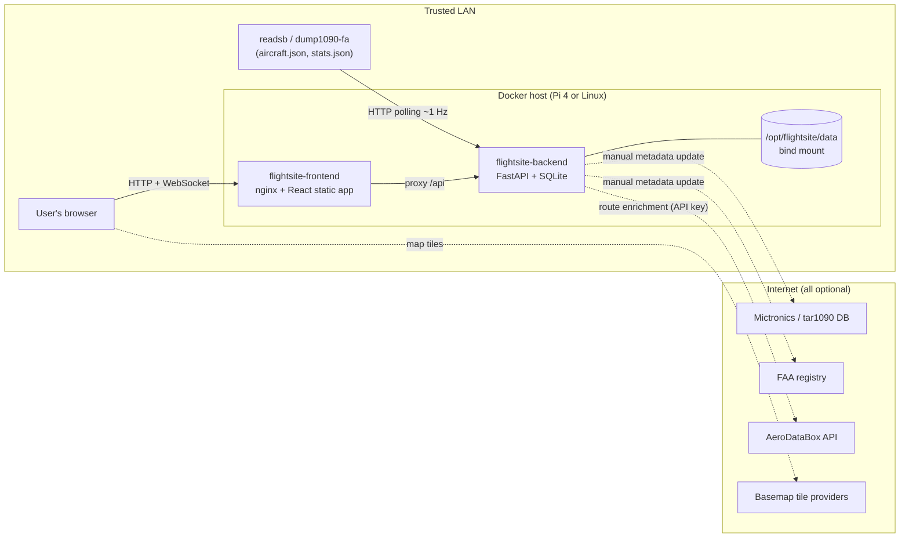
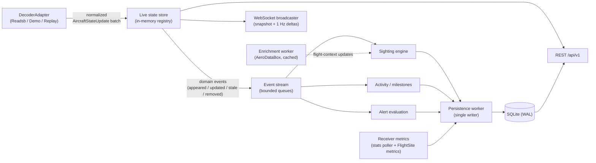

# FlightSite Architecture

This document describes the v1 system architecture. It is governed by
[`planning/SPEC.md`](../planning/SPEC.md); consequential decisions are recorded in
[`docs/adr/`](adr/README.md). The canonical execution plan is
[`planning/roadmap.yaml`](../planning/roadmap.yaml).

## 1. System Context

FlightSite consumes an existing ADS-B decoder (readsb or dump1090-fa) over HTTP/JSON.
It does not decode RF itself ([ADR-0003](adr/0003-decoder-adapter-abstraction.md)).



Everything in the `NET` group is optional: the core product (live map, sightings,
history, analytics, alerts) works with no internet access. Only basemap imagery and
enrichment degrade.

## 2. Deployment Topology

Two containers, orchestrated by Docker Compose
([ADR-0002](adr/0002-two-container-compose-topology.md)):

| Container | Contents | Role |
|---|---|---|
| `flightsite-frontend` | nginx serving the built React app | Static assets; reverse-proxies `/api` (including WebSocket upgrade) to the backend |
| `flightsite-backend` | FastAPI application (uvicorn) | Ingestion, live state, persistence, alerts, analytics, APIs |

There is no database container: SQLite runs in-process in the backend
([ADR-0001](adr/0001-sqlite-sole-persistence-store.md)).

### 2.1 Data directory contract

All persistent state lives under a single host bind mount, default
`/opt/flightsite/data`:

```text
/opt/flightsite/data/
  config.yaml        # canonical non-secret configuration
  secrets.yaml       # optional secrets (AeroDataBox key), env vars may override
  flightsite.sqlite3 # application database (+ -wal/-shm)
  logs/              # rotating structured logs
  backups/           # default backup output location
```

No anonymous Docker volumes hold important state. Moving this directory plus the
compose file to another compatible host moves the installation (SPEC §116).
`FLIGHTSITE_DATA_DIR` overrides the location (used by tests and non-container runs).

Images are published to GHCR for `linux/arm64` and `linux/amd64`.

## 3. Backend Architecture

### 3.1 Processing pipeline

The backend is a single asyncio process ([ADR-0008](adr/0008-asyncio-write-behind-persistence.md)).
The live path is memory-only; the database sits behind a write-behind worker so
ingestion never blocks on disk.



Rules the pipeline enforces:

- **Ingestion is authoritative for "now".** The live store answers all live queries
  from memory; no live request or decoder poll ever waits on SQLite.
- **Single-writer SQLite.** Exactly one writer session (the persistence worker) issues
  writes, batched into short transactions. Readers use separate connections; WAL keeps
  readers unblocked.
- **Everything else is a consumer.** Alerts, activity/milestones, receiver metrics,
  and enrichment consume events or read live state. A slow consumer can lag or drop to
  a resync; it cannot stall the adapter loop.
- **Metadata joins and rarity checks hit a cache, not the database.** The metadata &
  rarity cache (§ 3.3) is what preserves the no-SQLite-on-the-live-path invariant for
  metadata-enriched live payloads and per-update rule/rarity evaluation.

### 3.2 Module map

Package `flightsite` (backend/src/flightsite/), matching roadmap `expected_artifacts`:

| Module | Responsibility | Slice |
|---|---|---|
| `config/` | Settings model, config.yaml/secrets.yaml/env layering, write-back | 004 |
| `db/` | Engine, session discipline, Alembic wiring, integrity checks, meta/T0 | 005 |
| `ingest/` | `DecoderAdapter` protocol, `ReadsbJsonAdapter`, health state machine, connection test | 007 |
| `live/` | Live registry, lifecycle timing, derived fields, provenance, event stream | 008 |
| `sightings/` | Aircraft/sighting persistence core, write-behind worker, lifecycle, lifetime records, T0 | 009 |
| `sightings/tracks.py` | Track checkpointing, DP simplification, packed closed-track storage, reception stats, sighting events | 052 |
| `sightings/recovery.py` | Unclean-shutdown recovery of open sightings from checkpoints | 053 |
| `api/` | REST routers, WebSocket broadcaster, OpenAPI exposure | 010+ |
| `demo/` | Deterministic `DemoAdapter` scenarios | 011 |
| `devtools/` | Capture/replay CLI and `ReplayAdapter` | 012 |
| `metadata/` | Normalized metadata schema, `MetadataProvider`, import pipeline, precedence (`sources/mictronics.py`, `sources/faa.py`, and the opt-in `sources/opensky.py`) | 021–023, 059 |
| `classification/` | Military/gov/police + mission classification, operator normalization | 024 |
| `enrichment/` | `RouteEnrichmentProvider`, AeroDataBox client, cache, limits | 026 |
| `airports/` | Airport dataset, nearest-airport, arrival/departure inference | 027 |
| `analytics/` | Daily rollups, aggregation queries, presets | 031 |
| `receiver_metrics/` | Decoder stats ingestion, downsampling, pruning, lifetime aggregates | 033 |
| `activity/` | Activity events, milestone engine | 035 |
| `watchlists/` | Watchlist storage and live matching | 037 |
| `alerts/` | Rule model, evaluation, dedup, templates, emergency squawks | 038 |
| `diagnostics/` | Health aggregation, error ring buffers, counters | 042 |
| `backup/` | Backup/restore CLI, manifests, validation | 043 |
| `maintenance/` | Integrity checks, pruning execution, optimize/VACUUM policy | 044 |

### 3.3 Concurrency model

Asyncio tasks in one process:

- **Adapter loop** — polls the decoder at the configured interval, normalizes,
  applies the batch to the live store. Budget: apply-500-aircraft-batch well under one
  polling interval.
- **Lifecycle timer** — drives stale (15 s), live-removal (60 s), and sighting-close
  (10 min) transitions from a monotonic clock (configurable values). The silence those
  thresholds measure runs from the decoder's own report of when it last heard the
  aircraft, not from the last poll that listed it: both supported decoders keep a dead
  aircraft in their output for minutes, so an entry appearing in a poll is not an
  observation.
- **Persistence worker** — drains bounded queues of domain events into batched
  transactions. Backpressure policy: queues are bounded; on overflow, coalescible
  items (track points) are thinned first and a counter + diagnostic records the
  shedding. Losing a checkpoint batch is acceptable; blocking ingestion is not.
- **WebSocket broadcaster** — per-client outbound queues. A slow consumer's queue
  overflow triggers drop-and-resync (fresh snapshot), never global stalls.
- **Enrichment worker** — rate-limited, cached, circuit-broken; failures degrade to
  `Unknown`.
- **Metadata & rarity cache** — an in-memory map resolving metadata/classification
  for the live aircraft set, plus resident rarity counters (per-live-aircraft sighting
  counts and the full type-count table). Populated asynchronously on aircraft-appear
  events (off the hot path), incremented in memory as sightings open, and invalidated
  + repopulated when a metadata import completes. Memory bound: live set
  (≤ ~1,000 aircraft × ~1 KB) plus a few thousand type-stat rows — well inside the
  <1 GB budget. This cache is what preserves the "no live request or decoder poll
  ever waits on SQLite" invariant for metadata joins and rule/rarity evaluation;
  slices 021 (build), 024 (classification fields), and 038 (rarity conditions)
  implement and consume it.
- **Stats poller / maintenance scheduler** — low-frequency background tasks.

Blocking or CPU-heavy work (imports, simplification of long tracks, backups) runs via
`asyncio.to_thread` or subprocess so the event loop stays responsive.

### 3.4 Persistence

SQLite (WAL, `synchronous=NORMAL`, `busy_timeout`, `foreign_keys=ON`) via
SQLAlchemy 2.x async (aiosqlite) with Alembic migrations applied at startup. Details
and rationale: [ADR-0001](adr/0001-sqlite-sole-persistence-store.md); schema in
[`docs/DATA_MODEL.md`](DATA_MODEL.md).

Track storage ([ADR-0005](adr/0005-track-checkpointing-and-simplification.md)):
points are checkpointed in row-per-point batches while a sighting is active (bounding
power-loss data loss); on close the path is Douglas-Peucker-simplified and stored as
one **packed row per sighting** — a compact encoding of ordered timestamped points —
and the checkpoint rows are deleted. Sufficient for future playback without
implementing it, and it keeps multi-year track storage inside the Pi 4 budget
(slice 052).

Unclean shutdown: WAL recovery + startup `quick_check` + repair/closure of sightings
left open, with diagnostics (slices 005/053/044).

### 3.5 Provider interfaces

Internal seams only — no plugin ecosystem
([ADR-0006](adr/0006-provider-architecture.md)):

```python
class DecoderAdapter(Protocol):
    async def start(self) -> None: ...
    async def stop(self) -> None: ...
    def updates(self) -> AsyncIterator[Sequence[AircraftStateUpdate]]: ...
    def health(self) -> AdapterHealth: ...

class MetadataProvider(Protocol):
    async def download(self, workdir: Path) -> SourceArtifact: ...
    def validate(self, artifact: SourceArtifact) -> ValidationReport: ...
    def transform(self, artifact: SourceArtifact) -> Iterator[NormalizedAircraftRecord]: ...

class RouteEnrichmentProvider(Protocol):
    async def lookup(self, ctx: FlightContextQuery) -> RouteInfo | None: ...
```

Implementations in v1: `ReadsbJsonAdapter`, `DemoAdapter`, `ReplayAdapter`;
`MictronicsProvider`, `FaaRegistryProvider`; `AeroDataBoxProvider`. Reserved seams
(documented here and in ADR-0006 only — no code protocols are declared until a first
consumer exists): ownership providers, photo providers, notification providers,
further decoder adapters (Beast/SBS/remote).

## 4. API Surface

Split surface ([ADR-0007](adr/0007-api-surface-split.md)):

- **`/api/v1`** — documented, supported, **read-only** REST + WebSocket
  (`/api/v1/ws/live`). This is the external contract (SPEC §74).
- **`/api/internal`** — mutations the frontend needs (config, rules, watchlists,
  metadata update, reset). Undocumented, unversioned, may change any release.

Full endpoint catalog: [`docs/API.md`](API.md). No authentication in v1; trusted-LAN
assumption ([ADR-0010](adr/0010-no-auth-trusted-lan.md), `docs/SECURITY.md`).

## 5. Frontend Architecture

Vite + React 18 + TypeScript (strict), Tailwind CSS + shadcn/ui + Lucide, feature-folder
layout under `frontend/src/features/` (map, aircraft-detail, filters, setup, settings,
analytics, receiver, activity, interesting, alerts, watchlists, health, …).

State model:

- **Live data**: a WebSocket client (reconnect + backoff, snapshot-then-delta) feeds a
  Zustand live store. Map layers and live panels subscribe to it. Position
  interpolation happens client-side, between successive position *fixes* rather
  than between 1 Hz frames: frames arrive every second, but a distant aircraft
  decodes a new position only every 2-10 s, and the store dates the two
  separately so dead reckoning is anchored to the fix.
- **Request/response data** (history, analytics, settings): TanStack Query against
  REST, with normal caching/invalidation.
- **UI state** (selection, filters, theme, panel layout): Zustand + URL params where
  shareable; theme persisted to localStorage (dark default).

Map: MapLibre GL JS behind a basemap registry (multiple styles, dark aviation default,
attribution per style; provider choice ADR'd in slice 013). Aircraft, labels, range
rings, and overlays are distinct layers; tile failure leaves a usable dark canvas.
Charts: ECharts with shared dark/light theming (time series + polar
range-by-bearing).

The frontend holds no domain logic that the backend also implements (classification,
rarity, alert matching, analytics all come computed from the API); it only formats,
filters the live set, and renders.

## 6. Performance Architecture

Envelope (SPEC §5): Pi 4, ~500 concurrent aircraft, ~1 Hz updates, years of history,
backend comfortably under 1 GB RSS.

Budgets and where they are enforced:

| Budget | Mechanism | Enforced |
|---|---|---|
| Batch apply (500 aircraft) ≪ polling interval | dict-based registry, no per-update allocic churn, no awaits into DB | slice 008 sanity test; hard gate in 049 |
| Ingestion never blocks on DB | write-behind worker, bounded queues, shedding policy, metadata & rarity cache | design (ADR-0008); backpressure test in 009; cache instrumentation test in 021; gate in 049 |
| WS fan-out at 1 Hz to multiple clients | batched deltas, per-client queues, drop-and-resync | slice 010 tests; measured in 049 |
| Memory < 1 GB | bounded live tracks in memory, streamed imports, capped caches | trend + hard gate in 049 |
| Analytics on multi-year DB responsive | incremental daily rollups (no raw scans), indexes per DATA_MODEL | slice 031 budgets; qualified in 050 |
| Metric storage bounded | 14-day high-res window → hourly/daily downsampling + pruning (ADR-0009) | slices 033/044; qualified in 050 |

Perf regression harness and Pi 4 qualification: slices 049/050, `docs/PERFORMANCE.md`.

## 7. Failure & Degradation Model

| Failure | Behavior |
|---|---|
| Decoder unreachable | Health → degraded/down; automatic reconnect with backoff; live aircraft age out normally; receiver-offline/restored activity events; UI shows state clearly |
| Internet down | Core fully functional. Metadata update and enrichment fail with per-source status; cached enrichment persists; `Unknown` displayed, never fabricated |
| Tile provider down | Map degrades to dark canvas + rings + aircraft; core interactions intact |
| AeroDataBox errors/limits | Circuit breaker + cache; enrichment silently absent, counted in diagnostics |
| Power loss / kill -9 | WAL recovery; startup integrity check; open sightings repaired/closed with bounded track loss (last checkpoint); diagnostics on anomalies |
| Slow WS client | Drop-and-resync for that client only |
| DB slow/contended | Live path unaffected (memory); persistence queue depth surfaces in diagnostics; shedding before stalling |
| Malformed decoder output | Adapter-level hardening; bad records dropped and counted; ingestion never crashes |

## 8. Future-Proofing (Designed For, Not Built)

- **Multi-receiver**: single-receiver v1, but persistent entities avoid baking
  "the one receiver" into keys where it would be crippling; receiver identity lives in
  config/meta so a future `receiver_id` column migration is tractable (SPEC §12).
- **Historical playback**: closed sightings keep ordered timestamped simplified
  points in a packed per-sighting encoding (ADR-0005) — enough to animate later.
- **More decoders / providers / notification channels**: adapter and provider seams
  (§3.5) are the extension points; nothing outside them knows source specifics.
- **Auth**: all mutations already segregated under `/api/internal`, giving a future
  auth layer a clean perimeter (ADR-0010).
